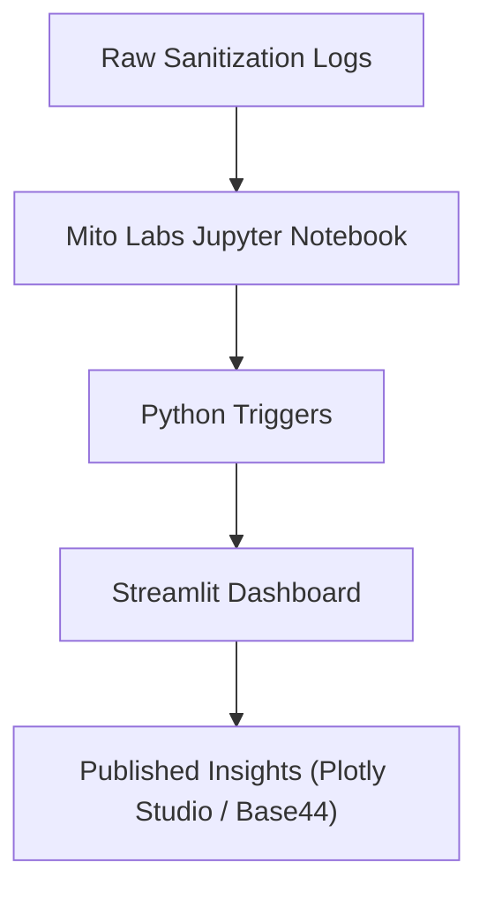

# 💻 Day 2 — GitHub, Markdown, and README Mastery  
### *How to Build Living Documentation That Teaches, Tracks, and Inspires*

---

## 🎯 Learning Objectives  

By the end of Day 2, you will:  
- Create a **README.md** file that acts like a **mini dashboard**.  
- Learn to use **Shields.io badges** to communicate project health and AI-readiness at a glance.  
- Build **Mermaid diagrams** to visualize workflows directly in GitHub.  
- Understand why your README is the **front door of your project**, not just a text file.  
- Learn how to structure documentation for **clarity, credibility, and collaboration**.

---

## 🧭 Why This Matters  

In modern data and AI development, your README is more than a static file —  
it’s a **self-documenting interface** between you, your model, and the world.

Think of it as a **live product sheet** that:
- tells your project’s story,  
- teaches others how to use it,  
- and shows your technical maturity at a glance.

For healthcare and compliance-driven work, this transparency builds **trust** — it shows your systems are documented, reproducible, and explainable.

---

## 🧱 Section 1 — Understanding GitHub as a Knowledge Hub  

GitHub isn’t just for code.  
It’s where **ideas live, grow, and are versioned**.

| Concept | Purpose | Example |
|----------|----------|----------|
| **Repository (Repo)** | Folder that stores your entire project | `7Day-AI-Dashboard-Course` |
| **Commit** | Saved snapshot of your work | “Added Day2 README section” |
| **Branch** | Parallel version for testing ideas safely | `dev` branch for experimenting |
| **Pull Request (PR)** | Propose merging your updates | Review + approval process |
| **README.md** | Your project’s landing page | Shows purpose, visuals, and usage |

> 🧠 **Pro Tip:**  
> Treat your README like a **product page** — your first impression for recruiters, collaborators, and AI tools that read Markdown context.

---

## ✍️ Section 2 — Markdown Basics (Your Dashboard Language)

Markdown (`.md`) is a **lightweight markup language** that transforms plain text into formatted documents — perfect for GitHub, Notion, and RStudio projects.

| Element | Markdown Syntax | Example |
|----------|------------------|----------|
| **Headers** | `#`, `##`, `###` | `# Project Title` |
| **Bold / Italic** | `**bold**` / `*italic*` | **AI Dashboard** |
| **Lists** | `-` or `1.` | `- Data cleaning` |
| **Code Blocks** | \`\`\`language | Python, R, HTML |
| **Links** | `[Text](URL)` | [Plotly Studio](https://plotly.com) |
| **Images** | `` |  |

> 🧩 Combine these simple tools and you can build entire interactive **documentation dashboards** with visuals, colors, and progress tracking.

---

## 🏗️ Section 3 — Creating a README That Feels Alive  

### Example Project Header

```markdown
# 🏥 AI Dashboard Project


````

These **Shields.io badges** communicate status like:

* ✅ Build passing
* 🤖 AI-ready
* 📜 License: MIT
  They add color, hierarchy, and instant trust to your repo.

---

### Table of Contents (Auto-Navigation)

```markdown
## 🧭 Table of Contents

1. [Overview](#overview)
2. [Architecture](#architecture)
3. [Setup](#setup)
4. [AI Prompts](#ai-prompts)
```

This lets users click and jump between sections — **like a mini dashboard menu**.

---

## 🔮 Section 4 — Visualizing Architecture with Mermaid

Mermaid diagrams transform your README into a **visual storytelling tool**.
They render directly inside GitHub.

### Example — Data Flow Diagram



**Explanation:**

* 🧼 Raw data is cleaned in **Mito Labs**
* 🧮 Logic runs through **Python triggers**
* 📊 Results are visualized in **Streamlit and Plotly Studio**
* ☁️ The dashboard is deployed for stakeholders

> 💡 **Pro Tip:**
> Each node in Mermaid can represent a **data stage**, **AI function**, or **compliance checkpoint** — it’s documentation *and* a visual model.

---

## 🧠 Section 5 — The AI in README

Modern GitHub repos use **AI-assisted README generation** tools like:

* **GitHub Copilot Chat**
* **ChatGPT-5 + Mito AI Plugin**
* **Claude for technical tone refinement**

### Why it matters:

* Keeps your README up-to-date automatically.
* Creates structured summaries of new commits.
* Makes your documentation **AI-readable** for future integrations.

### Example Prompt:

> “Analyze this GitHub README and suggest improvements for clarity, tone, and AI integration readiness.”

---

## 🧩 Section 6 — Your Turn: Build Your README Dashboard

**Assignment:**

1. Open your `7Day-AI-Dashboard-Course` repo on GitHub.
2. Create a new file named `README.md`.
3. Copy the example header, badges, and TOC above.
4. Add a Mermaid flowchart showing how your project flows from data → dashboard.
5. Commit and view the rendered README on GitHub.

### 🧭 Bonus Challenge

Add one more badge:

```markdown

```

---

## 🧾 Summary

* Markdown = your **dashboard language**.
* GitHub = your **data storytelling platform**.
* Mermaid = your **visual narrative**.
* Shields.io = your **status layer**.

Together, they form a **self-documenting data ecosystem** — one that speaks both to humans and to AI.

---

## 🧩 Deliverable

✅ Complete README.md file with:

* Title, badges, and table of contents
* At least one Mermaid diagram
* 2–3 sections of context-rich documentation

---

## 🧠 Reflection

1. What message does your README send before anyone even reads the code?
2. How can visuals (Mermaid diagrams, badges) replace paragraphs of text?
3. How might your README change as your dashboard becomes more agentic?

---

## 🚀 Next Step

Continue to **Day 3 — Setting Up Mito Labs & Jupyter**,
where you’ll turn raw data into clean, structured insight pipelines.

---

**Authored by:**
**Erwin Maurice McDonald**
*AI Strategist | Data Visualization Engineer | Healthcare Software Developer*

```
