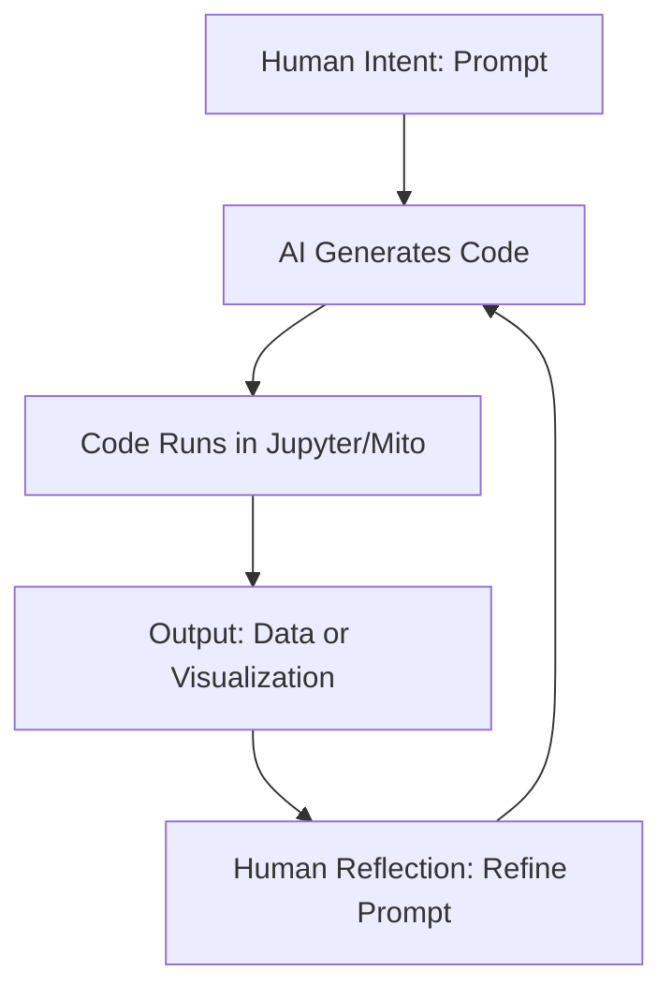

# 🤖 DAY 5 — Advanced Prompt Engineering

---

## 🧭 Overview

Welcome to **Day 5**, where you move beyond simple automation and into **AI-augmented creativity**.  
This is where you teach the AI *how to think with you*, not just for you.

You’ll learn how to design advanced prompts that chain logic, reuse AI outputs intelligently, and build entire scripts, graphs, and insights from text alone.

---

## 🧠 Learning Objectives

By the end of this lesson, you’ll be able to:

- Use **AI Co-Pilot** and **ChatGPT** to generate working Python code for dashboards.
- Understand **context chaining**, where one AI output becomes the next input.
- Structure prompts for **data visualization, logic building, and storytelling.**
- Design your own “AI workbench” workflow to produce consistent, testable results.

---

## 💡 What is Advanced Prompt Engineering?

Advanced prompt engineering means building a **conversation architecture**, not just a single request.  
Instead of saying *“Make a chart,”* you teach the AI:

1. What role it’s playing (e.g., *“You are a data scientist…”*).  
2. What tools it should use (e.g., *pandas, plotly, matplotlib*).  
3. What output you expect (e.g., *a line graph of sanitizer usage by department*).  
4. How to explain its reasoning or annotate the chart.

This creates a **closed feedback loop** between your intent and the AI’s execution.

---

## 🧩 Key Concepts

| Concept | Description | Example |
|----------|-------------|----------|
| **Context Chaining** | Feeding previous AI outputs into new prompts for iterative refinement. | Use yesterday’s cleaned data summary to generate a visualization prompt. |
| **Role Assignment** | Framing the AI’s perspective for higher relevance and accuracy. | “Act as a hospital data scientist specializing in infection control.” |
| **Prompt Memory** | Reusing key variables, code snippets, and summaries from earlier prompts. | “Using the same DataFrame from the last step, calculate compliance trends.” |
| **Explainable Generation** | Requesting code and explanations together for better learning. | “Show me the pandas code and explain each line.” |

---

## ⚙️ Example Prompt

> “You are a data scientist working in infection control.  
> Write Python code using pandas and plotly.express to visualize sanitizer usage trends across departments over time.”

This one sentence does four things:
1. Defines the AI’s **role**.  
2. Specifies the **domain context**.  
3. Names the **tools and libraries**.  
4. Describes the **visual goal**.

---

## 🧪 Example AI Output

```python
import pandas as pd
import plotly.express as px

# Load your cleaned data from Day 4
df = pd.read_excel("cleaned_output.xlsx")

# Convert dates if available
df['Date'] = pd.to_datetime(df['Date'], errors='coerce')

# Group sanitizer usage by department
usage = df.groupby('Department', as_index=False)['Usage_Count'].sum()

# Create a bar chart
fig = px.bar(
    usage,
    x='Department',
    y='Usage_Count',
    title='Sanitizer Usage by Department (Monthly Totals)',
    color='Department',
    text_auto=True,
    color_discrete_sequence=px.colors.sequential.Blues
)

fig.update_layout(
    plot_bgcolor='#111111',
    paper_bgcolor='#111111',
    font=dict(color='#E5E7EB')
)

fig.show()
````

---

## 🔁 Context Chaining in Action

The best AI workflows don’t end with one prompt — they **chain**.

### Step 1 — Create Context

Ask:

> “Summarize the top 3 departments with highest sanitizer usage.”

### Step 2 — Reuse Context

Now feed that output into a new prompt:

> “Generate Python code using that insight to highlight these departments on a Plotly graph.”

### Step 3 — Reflect and Explain

Ask:

> “What trend do you see over time, and what might this mean for inventory planning?”

Each prompt layer strengthens the next — this is *context engineering in motion*.

---

## 🧱 Building an AI Workbench

When you use AI as a co-pilot for analytics, you’re really building a **feedback loop**:



Each loop produces cleaner, more useful results as you guide the AI with better context.

---

## 🧩 Practice Exercise: The Co-Pilot Loop

Try this 3-step cycle:

1. **Prompt:**
   “Using pandas, calculate sanitizer usage per department and show a Plotly trend line.”

2. **Run the code** generated by the AI.

3. **Refine:**
   “Now add a threshold line for departments exceeding 250 uses.”

4. **Reflect:**
   What insights can you derive from this new chart?

Each repetition builds muscle memory for AI-guided analytics.

---

## 🧠 Bonus: Teach the AI to Audit Itself

Advanced prompt engineers don’t just get code — they make the AI evaluate its own work.

> “Before showing the chart, check for missing values and print the data quality summary.”

You can even chain this with your trigger scripts from Day 4, creating a **self-healing pipeline**:

1. Trigger cleans data.
2. AI generates visualization.
3. AI audits results.
4. Dashboard updates automatically.

---

## 🧰 Recommended Tools

| Tool                    | Purpose                              |
| ----------------------- | ------------------------------------ |
| **ChatGPT-5 / CoPilot** | Interactive code & logic generation  |
| **Plotly Studio**       | No-code visual designer              |
| **Mito Labs**           | Data wrangling + trigger cell export |
| **VS Code or Jupyter**  | Execution environment                |
| **LangChain / Python**  | Chaining AI outputs programmatically |

---

## 🧪 Mini Project: Infection Control Trend Dashboard

Create a small AI-driven dashboard prototype using this workflow:

1. Use your cleaned file from Day 4.
2. Ask the AI to generate 2 charts:

   * A **bar chart** showing sanitizer usage per department.
   * A **line chart** showing total usage trend over time.
3. Add labels, a color scale, and a title.
4. Export the code to a `.py` file and run it in VS Code or Mito Labs.
5. Optional: embed your chart in a Streamlit or Shiny dashboard.

---

## 💬 Reflection

Ask yourself:

* Did your AI-generated code run the first time?
* What assumptions did it make about your data?
* How did refining your prompt improve the output?
* How could you apply this to real hospital or clinic data?

---

## ✅ Summary

| Skill                     | Description                                         |
| ------------------------- | --------------------------------------------------- |
| **Prompt Design**         | Build structured prompts that teach the AI its role |
| **Context Chaining**      | Reuse AI outputs for cumulative insights            |
| **Visualization Prompts** | Generate real charts from text                      |
| **AI Co-Pilot Workflow**  | Iterative prompt-code-review cycle                  |
| **Self-Auditing Logic**   | Build intelligent AI that checks its work           |

---

## 🧠 Next Lesson

Tomorrow (Day 6), you’ll integrate your AI-generated code into **interactive dashboards** using **Streamlit, Plotly Studio, and Base44 hosting** — turning all your work into a polished, shareable application.

---

### ✍️ Authored by

**Erwin Maurice McDonald**
*AI Strategist | Data Visualization Engineer | Healthcare Software Developer*

```

---
