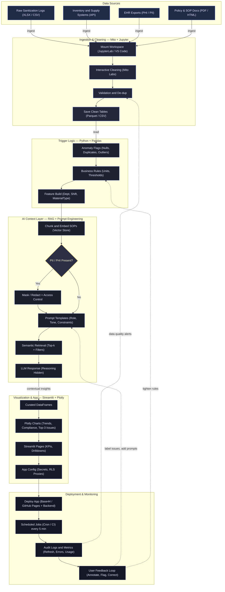

# 🏥 7-Day AI Context & Prompt Engineering Course  
### *From Raw Data to Streamlit Dashboards in One Week*  

**Author:** Erwin Maurice McDonald  
**Audience:** Advanced healthcare software developers working with sanitizing, cleansing, and reusable materials & data environments.  

---

## 🛠️ Shields.io Badges  


[-4C4EFF?style=for-the-badge&logo=shield&logoColor=white)](./LICENSE.md)


---

## 🎯 Course Summary  

This 7-day immersive program walks you through the **AI lifecycle from concept to dashboard**, bridging **context engineering**, **prompt strategy**, and **data visualization**.  
By the end, you’ll build a **fully functional healthcare compliance dashboard** using **RAG, Streamlit, Plotly Studio, and Mito Labs**.  

---

## 🧠 Learning Outcomes  

- Understand **Generative vs Agentic AI** and **Retrieval-Augmented Generation (RAG)**.  
- Build context-aware dashboards using **Mito Labs** and **Python triggers**.  
- Apply **AI prompting strategies** to automate healthcare data workflows.  
- Deploy an end-to-end **Streamlit dashboard** integrated with real data.  

---

## ⚙️ Tech & Tool Stack  

| Category | Tools / Frameworks | Purpose |
|-----------|-------------------|----------|
| **AI & Context** | ChatGPT-5, Claude, LangChain | Generative vs Agentic AI & RAG |
| **Versioning** | GitHub, Markdown, Shields.io | Documentation & repo setup |
| **Data Layer** | Python, Pandas, Mito Labs | Cleansing, transformation |
| **Visualization** | Plotly Studio, Base44 | Data visualization & embedding |
| **Dashboarding** | Streamlit, Mito App Mode | Interactive front-end |
| **Hosting** | GitHub Pages / Base44 | Deployment & collaboration |

---

## 📂 Folder Structure  

```plaintext
7Day-AI-Dashboard-Course/
│
├── README.md
│
├── Day1_Generative_vs_Agentic_AI.md
├── Day2_GitHub_README_Badges.md
├── Day3_Mito_Jupyter_Setup.md
├── Day4_Python_Triggers.md
├── Day5_Advanced_Prompts.md
├── Day6_Plotly_Streamlit.md
├── Day7_Final_Dashboard.md
│
└── data/
    └── TG_Product_Activity_2025.xlsx
````

---

## 🧩 Mermaid Workflow Diagram



---

## 🚀 How to Use This Repo

1. Clone this repository:

   ```bash
   git clone https://github.com/yourusername/7Day-AI-Dashboard-Course.git
   cd 7Day-AI-Dashboard-Course
   ```
2. Open each Day’s `.md` file sequentially (Day 1–7).
3. Follow code examples, prompts, and exercises.
4. Use `data/TG_Product_Activity_2025.xlsx` as your working dataset.
5. Deploy your final dashboard with:

   ```bash
   streamlit run app.py
   ```

---

## 💡 Next Steps

Each lesson file (Day 1–7) will include:

* Learning objectives
* AI prompts
* Python code examples
* Visual diagrams (Plotly/Mermaid)
* Deliverable checklists

---

### ✍️ Author

**Erwin Maurice McDonald**
*AI Strategist | Data Visualization Engineer | Healthcare Software Developer*


```
